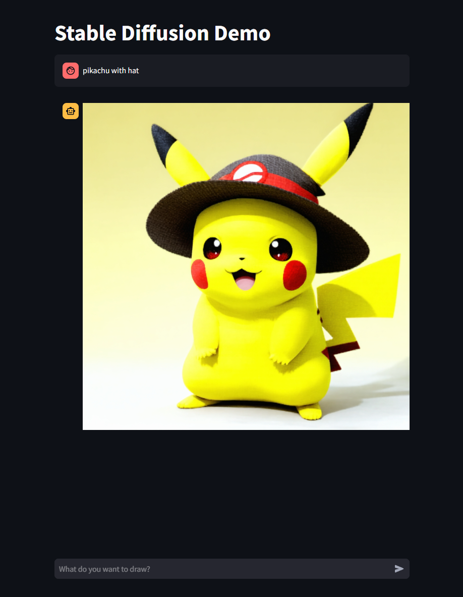

# Stable Diffusion Demo
This repo contains demo for generating image based on user prompt.
- Model: stable diffusion 3.5 large
- UI: Streamlit
- Require NVIDIA GPU

## How to install
1. Install [Conda](https://docs.conda.io/projects/conda/en/latest/user-guide/install/index.html)
2. Create environment: `conda create -n sd python=3.11`
3. Activate environment: `conda activate sd`
4. Install [Pytorch](https://pytorch.org/get-started/locally/)
5. Install the required libraries: `pip install -r requirements.txt`

## Huggingface 

## How to run
1. Run the following command:
`streamlit run main.py`
2. Open the Local URL in a browser.

## Example
