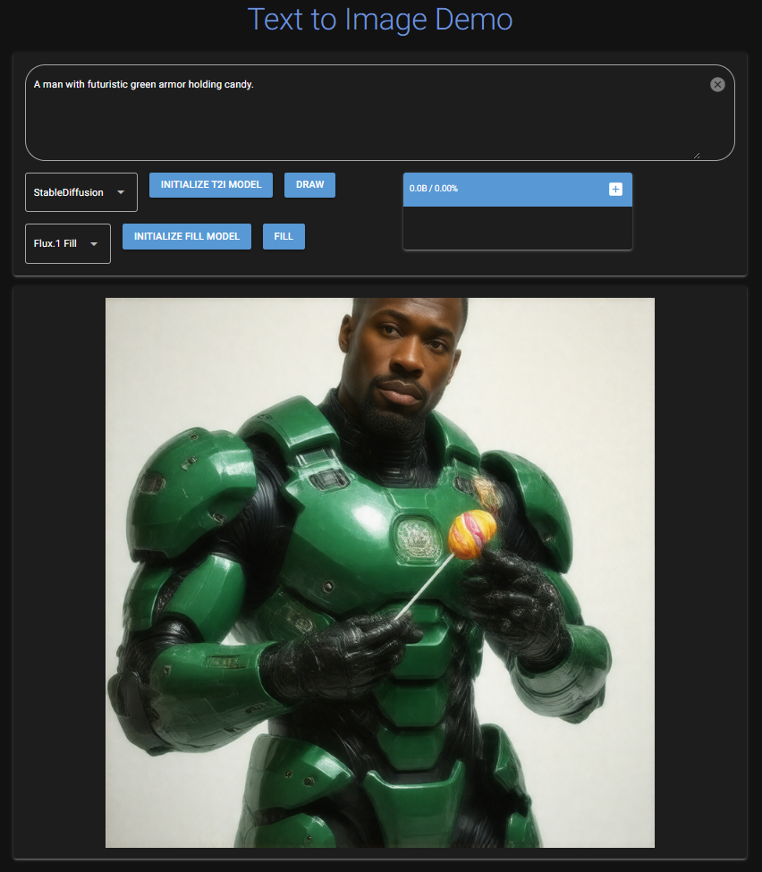
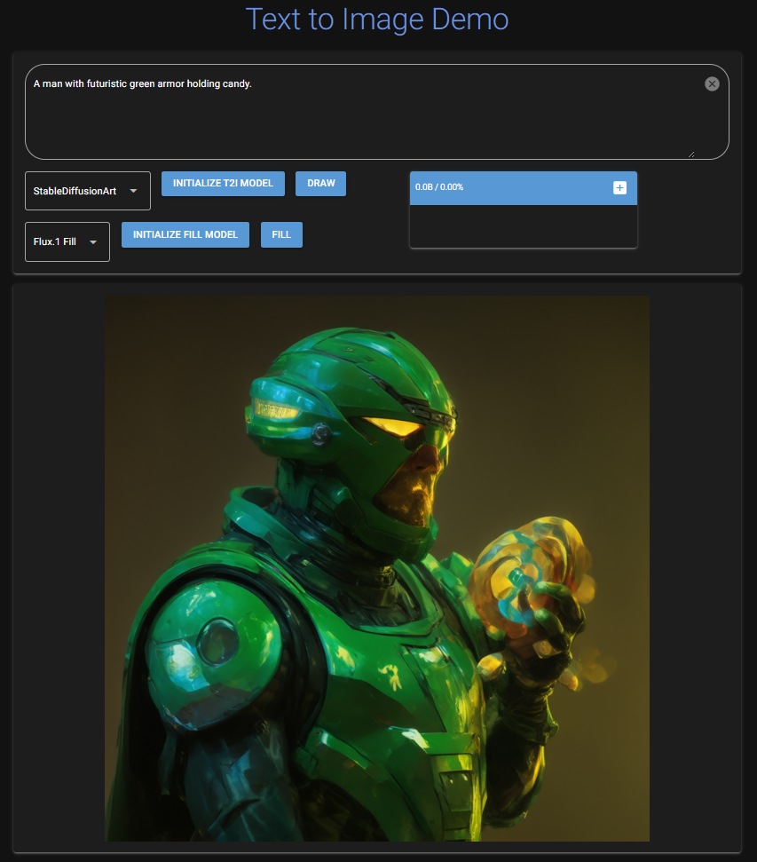
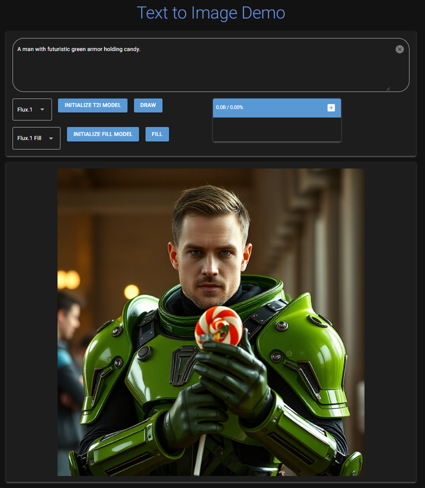

# Text to Image Demo
This repo contains demo for generating image based on user prompt. It runs model locally for the sake of PoC and is not suitable for production. Require NVIDIA GPU to run.

## TODO:
- [x] Implement quantized Stable Diffusion 3.5.
- [x] Implement quantized Flux.1 Schnell.
- [x] Implement factory pattern to handle models.
- [x] Add model switching feature.
- [x] Implement NiceGUI ui.storage to store session states.
- [ ] Better code modularization.
- [x] Add brush and inpainting features.
- [ ] Add models outputs comparison feature.
- [ ] Use javascript for brush to bring the feature to client side.
- [ ] To explore Auto1111sdk. (Dec 27, 2024: Only support Stable Diffusion as of the date, so won't implement soon.)

## How to install
1. Install [Conda](https://docs.conda.io/projects/conda/en/latest/user-guide/install/index.html)
2. Create environment: `conda create -n sd python=3.11`
3. Activate environment: `conda activate sd`
4. Install [Pytorch](https://pytorch.org/get-started/locally/)
5. Install the required libraries: `pip install -r requirements.txt`

## Huggingface Access Token & Model Registration
1. Follow [this](https://huggingface.co/docs/hub/en/security-tokens) to create access token.
2. Visit the following links to register:
    - [Flux.1 Schnell](https://huggingface.co/black-forest-labs/FLUX.1-schnell)
    - [Stable Diffusion 3.5 Large Turbo](https://huggingface.co/stabilityai/stable-diffusion-3.5-large-turbo)
    - [Stable Diffusion 3.5 Medium Turbo TensorArt](https://huggingface.co/tensorart/stable-diffusion-3.5-medium-turbo)
    - [Stable Diffusion 2 Inpainting](https://huggingface.co/stabilityai/stable-diffusion-2-inpainting)
    - [Flux.1 Fill dev](https://huggingface.co/black-forest-labs/FLUX.1-Fill-dev)
3. In terminal, after activating `sd` environment, type `huggingface-cli login` and key in the created access token to login.

## How to run
1. Run the following command: `python src/main.py`
2. Open the Local URL (default: http://localhost:8080/) in a browser.

## Example
<table>
    <tr>
        <td>Quantized Stable Diffusion 3.5 Large Turbo (StabilityAI)</td>
        <td>Stable Diffusion 3.5 Medium Turbo (TensorArt)</td>
        <td>Quantized Flux.1 Schnell (Black Forest Labs)</td>
    </tr>
    <tr>
        <td></td>
        <td></td>
        <td></td>
    </tf>
</table>

<table>
    <tr>
        <td>Original Image generated by Quantized Stable Diffusion 3.5 Large Turbo</td>
        <td>Brush the image with a mask on the canvas directly</td>
        <td>Fill a spaceship to the region with Stable Diffusion 2 Inpainting</td>
    </tr>
    <tr>
        <td></td>
        <td></td>
        <td></td>
    </tf>
</table>